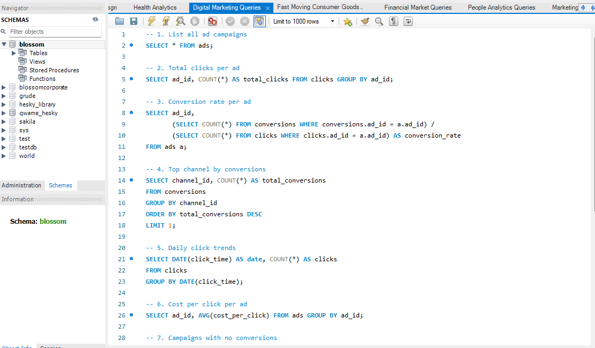
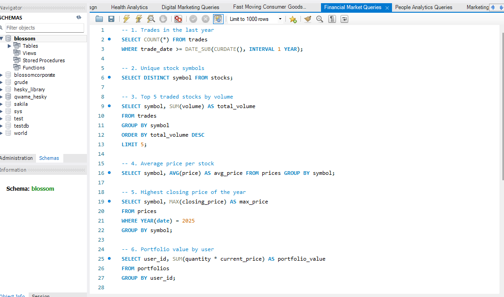
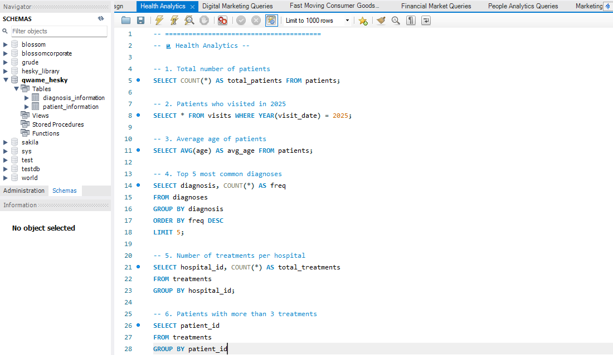
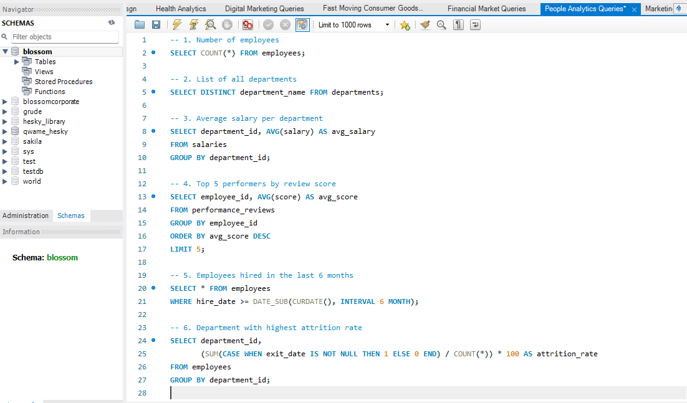
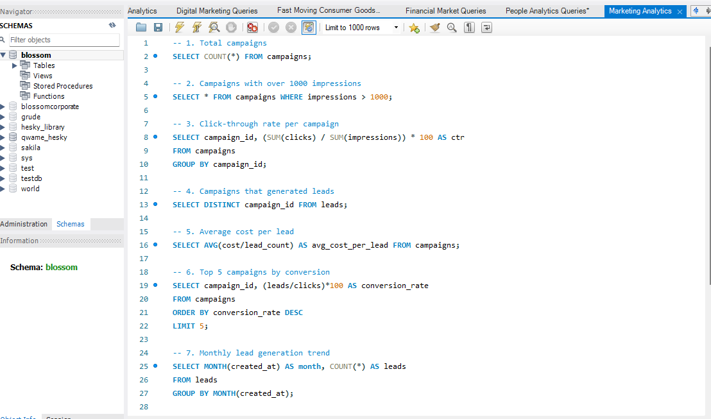
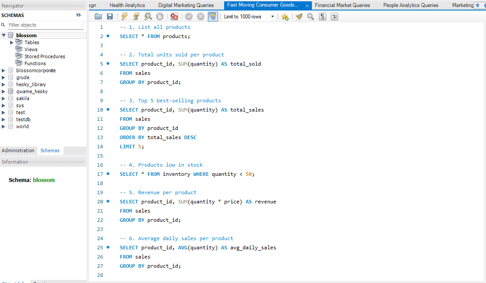

# SQL Queries Insights

This repository showcases a collection of SQL queries designed to answer essential business questions across multiple domains: Digital Marketing, Financial Markets, Health Analytics, and People Analytics. Each section below introduces the purpose of SQL queries and then provides a brief overview of the type of insights the queries in each file are designed to produce. For each domain, a screenshot of the queries is included for reference.

---

## Introduction to SQL Queries

Structured Query Language (SQL) is the standard language used to communicate with relational databases. It allows users to retrieve, analyze, and manipulate large sets of data efficiently. By using SQL queries, analysts and developers can extract specific insights, summarize trends, and support data-driven decision-making in various domains.

---

## Digital Marketing Queries

The Digital Marketing queries focus on evaluating the effectiveness and efficiency of advertising campaigns. The queries provide answers to questions such as:
- What campaigns are running?
- How many clicks and conversions does each ad receive?
- What is the conversion rate of each ad?
- Which marketing channel is most successful?
- What are the daily trends in user engagement?
- What is the average cost per click?
- Are there campaigns that are not converting at all?

These insights help marketers optimize their campaigns and allocate resources more effectively.

---

## Financial Market Queries

Financial Market queries are designed to analyze trading activities and investment performance. The questions answered include:
- How many trades occurred in the last year?
- Which stock symbols are being traded?
- Which are the top 5 most traded stocks by volume?
- What are the average and highest prices of stocks within a given year?
- What is the total value of each user's portfolio?

These answers support investors and analysts in spotting trends, evaluating market activity, and making informed investment decisions.

---

## Health Analytics

Health Analytics queries help monitor and report on healthcare data for better patient and hospital management. They answer:
- How many patients are registered?
- How many patients visited in a specific year?
- What is the average age of patients?
- What are the most common diagnoses?
- How many treatments are performed per hospital?
- Which patients have received multiple treatments?

Such insights are crucial for hospital administrators and healthcare analysts to track patient care and resource utilization.

---

## People Analytics Queries

People Analytics queries focus on human resources and workforce management, providing answers to:
- How many employees are there?
- What departments exist in the company?
- What is the average salary per department?
- Who are the top performers?
- Who has been hired recently?
- Which department has the highest attrition rate?

These answers empower HR professionals to track organizational health and make better decisions regarding hiring, compensation, and retention.

---

## Screenshots of All Query Files

Below are all the screenshots referenced above:

### Digital Marketing Queries

### Financial Market Queries

### Health Analytics Queries

### People Analytics Queries

### Marketing Analytics Queries

### Fast Moving Consumer Goods Queries

